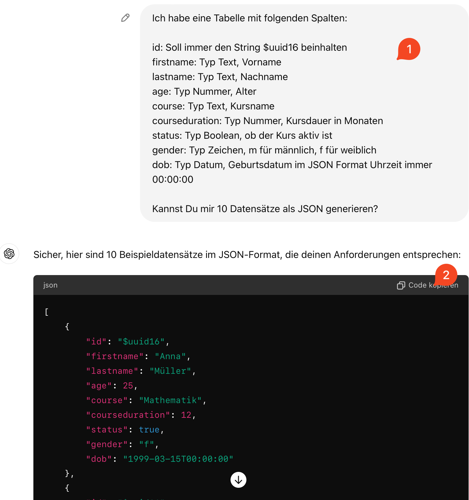
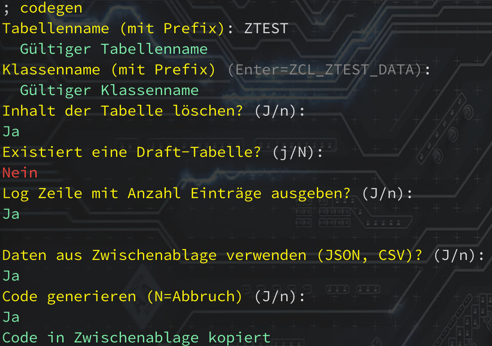

# Beispiel mit Chat GPT

Hier ein Beispiel, wie ich in 2 Minuten folgende Anfrage an ChatGPT gestellt habe. Im Screenshot wird nur ein Teil des JSON-Code gezeigt.



Daraus wurde in einer Minuten mit `codegen` Aufruf...



in insgesamt ca. 3 Minuten folgender ABAP Code:

```
CLASS zcl_ztest_data DEFINITION
  PUBLIC
  FINAL
  CREATE PUBLIC .

  PUBLIC SECTION.

    INTERFACES if_oo_adt_classrun .
  PROTECTED SECTION.
  PRIVATE SECTION.
ENDCLASS.


CLASS zcl_ztest_data IMPLEMENTATION.


  METHOD if_oo_adt_classrun~main.
  DATA itab TYPE TABLE OF ztest.

  itab = VALUE #(
    (
      age = 25
      course = 'Mathematik'
      courseduration = 12
      dob = 19990315
      firstname = 'Anna'
      gender = 'f'
      id = cl_system_uuid=>create_uuid_x16_static( )
      lastname = 'Müller'
      status = abap_true
 )
    (
      age = 30
      course = 'Informatik'
      courseduration = 24
      dob = 19930120
      firstname = 'Max'
      gender = 'm'
      id = cl_system_uuid=>create_uuid_x16_static( )
      lastname = 'Schmidt'
      status = abap_false
 )
    (
      age = 22
      course = 'Physik'
      courseduration = 18
      dob = 20010710
      firstname = 'Julia'
      gender = 'f'
      id = cl_system_uuid=>create_uuid_x16_static( )
      lastname = 'Schneider'
      status = abap_true
 )
    (
      age = 28
      course = 'Chemie'
      courseduration = 6
      dob = 19950925
      firstname = 'Lukas'
      gender = 'm'
      id = cl_system_uuid=>create_uuid_x16_static( )
      lastname = 'Fischer'
      status = abap_false
 )
    (
      age = 21
      course = 'Biologie'
      courseduration = 12
      dob = 20021205
      firstname = 'Sophia'
      gender = 'f'
      id = cl_system_uuid=>create_uuid_x16_static( )
      lastname = 'Weber'
      status = abap_true
 )
    (
      age = 29
      course = 'Geschichte'
      courseduration = 36
      dob = 19940414
      firstname = 'Leon'
      gender = 'm'
      id = cl_system_uuid=>create_uuid_x16_static( )
      lastname = 'Wagner'
      status = abap_false
 )
    (
      age = 26
      course = 'Philosophie'
      courseduration = 24
      dob = 19970622
      firstname = 'Mia'
      gender = 'f'
      id = cl_system_uuid=>create_uuid_x16_static( )
      lastname = 'Becker'
      status = abap_true
 )
    (
      age = 23
      course = 'Soziologie'
      courseduration = 12
      dob = 20001118
      firstname = 'Paul'
      gender = 'm'
      id = cl_system_uuid=>create_uuid_x16_static( )
      lastname = 'Hoffmann'
      status = abap_false
 )
    (
      age = 27
      course = 'Medizin'
      courseduration = 48
      dob = 19960228
      firstname = 'Laura'
      gender = 'f'
      id = cl_system_uuid=>create_uuid_x16_static( )
      lastname = 'Koch'
      status = abap_true
 )
    (
      age = 24
      course = 'Psychologie'
      courseduration = 24
      dob = 19990803
      firstname = 'Tom'
      gender = 'm'
      id = cl_system_uuid=>create_uuid_x16_static( )
      lastname = 'Richter'
      status = abap_false
 )
  ).

  DELETE FROM ztest.

  INSERT ztest FROM TABLE itab.

  out->write( | { sy-dbcnt } entries inserted successfully | ).

  ENDMETHOD.
ENDCLASS.
```
