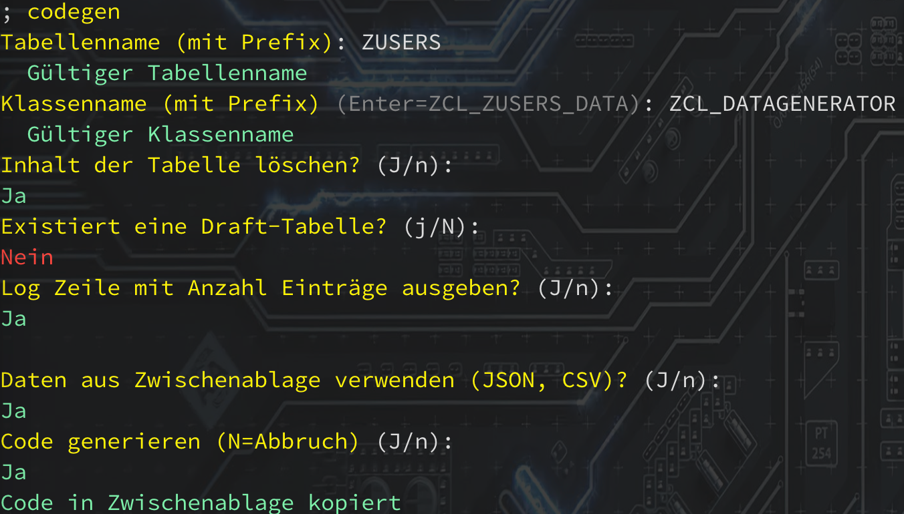

# Suportis Code Generator

## Beispiele

[Mit Chat GPT ABAP Code für 10 Datensätze für einen RAP Codegenerator](chatgpt.md)


## Einrichten

Einmaliges laden mit

```
Invoke-RestMethod https://raw.githubusercontent.com/bugfrei/SAPCodeGen/main/supacg.ps1 -OutVariable xxx | out-null; . ([scriptblock]::Create($xxx))
````

Installieren (in Profile, immer aktuelle Version)


```
Invoke-RestMethod https://raw.githubusercontent.com/bugfrei/SAPCodeGen/main/install.ps1 -OutVariable xxx | out-null; & ([scriptblock]::Create($xxx))
```

## Verwendung von Befehl `codegen`

Parameter besitzen autovervollständigung (Tab).

---

Parameter: `hilfe`

Zeigt eine Hilfe über JSON Datenformate mit Beispiel an.

---

Parameter: `DataGenerator` (Default)

Startet den Assistent zum erstellen von ABAP Code für das einfügen von Standarddaten in eine RAP Tabelle.

Es werden nacheinander folgende Eingaben abgefragt:

- Tabellenname (mit Prefix): z.B. ZUSERS
- Klassenname (mit Prefix): z.B. ZCL_DATAGENERATOR, Enter=Defaultname
- Frage ob der Inhalt der Tabelle gelöscht werden soll
- Frage ob es ein Draft Tabelle gibt
  - Name der Draft-Tabelle
  - Frage ob den Inhalt der Draft-Tabelle gelöscht werden soll
- Frage ob Log Zeile mit Anzahl Einträge ausgeben
  
Anschließend kann der Inhalt der Daten (JSON, CSV) aus der Zwischenablage geladen werden. Ist dieser in einer Datei kann mit `n` geantwortet werden und anschließend der Pfad zur Datei eingegeben werden.

Als letztes wird gefragt ob der Code generiert werden soll. Danach befindet sich der Code in der Zwischenablage



```
CLASS zcl_datagenerator DEFINITION
  PUBLIC
  FINAL
  CREATE PUBLIC .

  PUBLIC SECTION.

    INTERFACES if_oo_adt_classrun .
  PROTECTED SECTION.
  PRIVATE SECTION.
ENDCLASS.


CLASS zcl_datagenerator IMPLEMENTATION.


  METHOD if_oo_adt_classrun~main.
  DATA itab TYPE TABLE OF zusers.

  itab = VALUE #(
    (
      age = 25
      course = 'Computer Science'
      courseduration = 4
      dob = '19950101'
      firstname = 'John'
      gender = 'm'
      id = cl_system_uuid=>create_uuid_x16_static( )
      lastname = 'Doe'
      status = 'X'
 )
    (
      age = 30
      course = 'Mathematics'
      courseduration = 3
      dob = '19900215'
      firstname = 'Jane'
      gender = 'f'
      id = cl_system_uuid=>create_uuid_x16_static( )
      lastname = 'Smith'
      status = ''
 )
    ...
  ).

  DELETE FROM zusers.

  INSERT zusers FROM TABLE itab.

  out->write( | { sy-dbcnt } entries inserted successfully | ).

  ENDMETHOD.
ENDCLASS.
```

